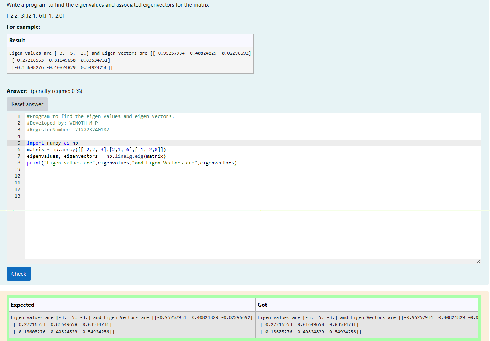

# EIGENVALUES-AND-EIGENVECTORS
## Aim:
To write a python program to find the Eigenvalues and Eigen Vectors
## Equipment’s required:
1. 	Hardware – PCs
2. 	Anaconda – Python 3.7 Installation / Moodle-Code Runner
## Algorithm:
### Step1 : import numpy as np
### Step 2: store the variable in a variable using np.array
### Step 3: Using the np.linalg.eig(),  we get two results (first is eigenvalue and second is eigenvector) of the given matrix.
### Step 4: print the respected eigen value and eigen vector

## Program:
```
#Program to find the eigen values and eigen vectors.
#Developed by: VINOTH M P
#RegisterNumber: 212223240182

import numpy as np
matrix = np.array([[-2,2,-3],[2,1,-6],[-1,-2,0]])
eigenvalues, eigenvectors = np.linalg.eig(matrix)
print("Eigen values are",eigenvalues,"and Eigen Vectors are",eigenvectors)
```
## Output:

## Result:
Thus the Eigenvalue and Eigenvector is successfully solved using python program
